# Transaction Flow Diagrams

**Format:** Mermaid diagrams (renders automatically in GitHub/GitLab)  
**Purpose:** Visual process flows for easy understanding and communication

---

## 1. Bond Trade Flow (Buy/Sell)

### Overall Flow

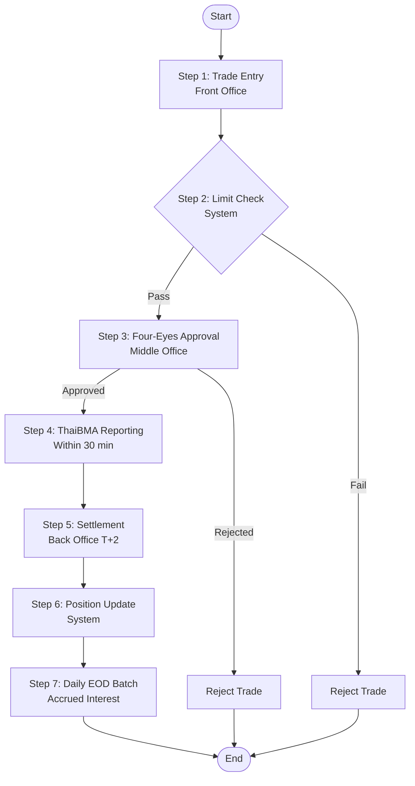

### Detailed Steps

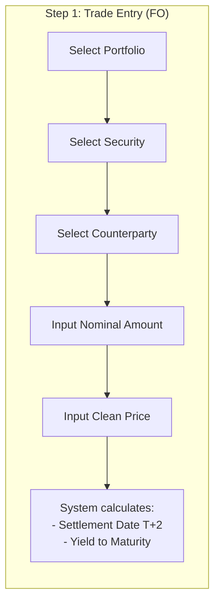

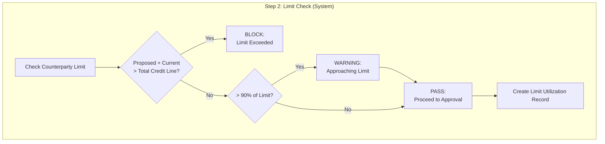

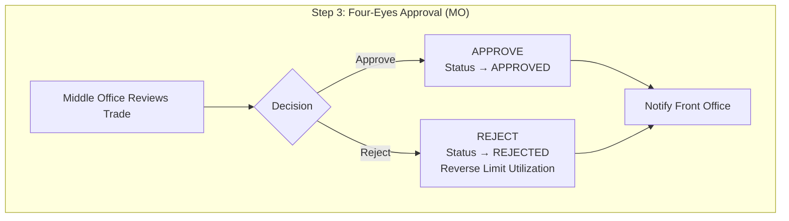

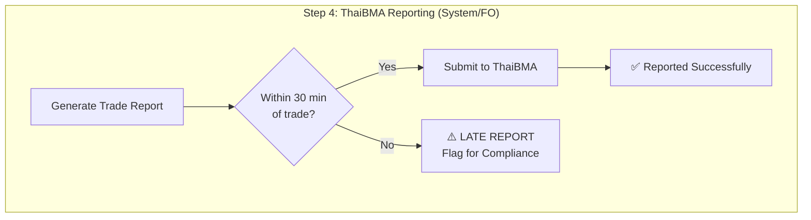

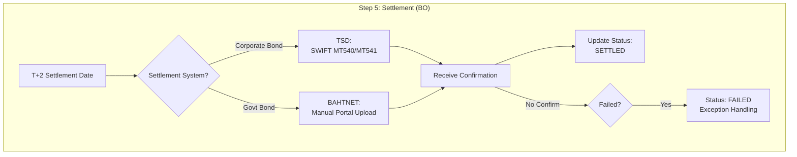

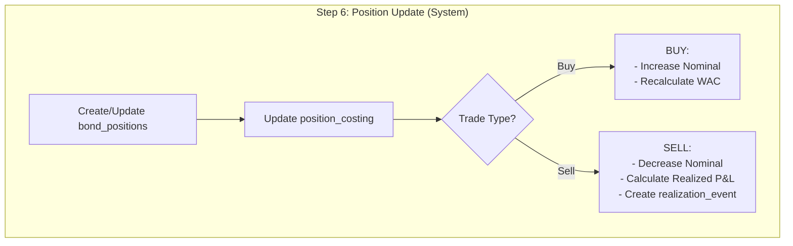

```mermaid
flowchart TD
    subgraph "Step 7: Daily EOD Batch (System 18:00)"
        D1[Calculate Accrued Interest<br/>Nominal × Coupon% × 1/365]
        D2[Update bond_positions<br/>accrued_interest]
        D3[Calculate Market Value<br/>(Price × Nominal/100) + Accrued]
        D4[Calculate Unrealized P&L<br/>Market Value - Book Value]
        D5[Generate GL Journals]
    end
    
    D1 --> D2 --> D3 --> D4 --> D5
```

---

## 2. Interbank Deal Flow (Lend/Borrow)

### Overall Flow

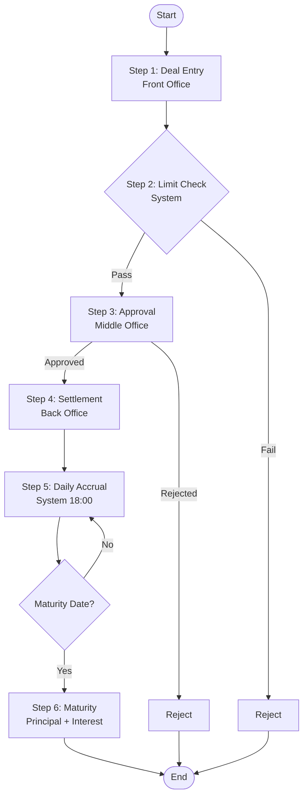

### Detailed Steps

```mermaid
flowchart LR
    subgraph "Step 1: Deal Entry (FO)"
        IE1[Select Deal Type:<br/>LEND or BORROW]
        IE2[Select Counterparty]
        IE3[Input Principal Amount]
        IE4[Input Value Date &<br/>Maturity Date]
        IE5[Select Rate Type:<br/>FIXED or FLOATING]
        IE6[Input Interest Rate<br/>(or Reference Rate + Margin)]
        IE7[System calculates Term]
    end
    
    IE1 --> IE2 --> IE3 --> IE4 --> IE5 --> IE6 --> IE7
```

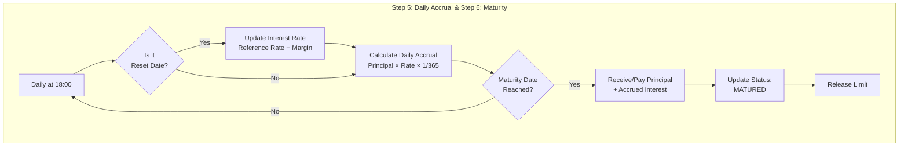

---

## 3. Repo Trade Flow (Repo/Reverse Repo)

### Overall Flow

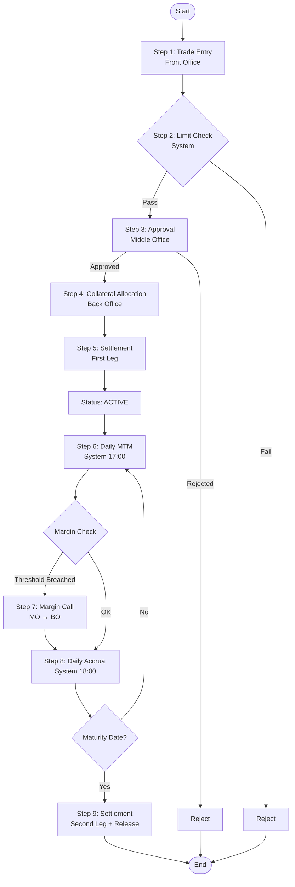

### Detailed Steps

```mermaid
flowchart LR
    subgraph "Step 4: Collateral Allocation (BO)"
        C1[Calculate Required Collateral<br/>Nominal / (1 - Haircut)]
        C2[Select Securities<br/>from Inventory]
        C3[Apply Haircut %
by Rating/Tenor]
        C4{Collateral Value<br/>>= Repo Exposure?}
        C5[✅ Allocate Collateral]
        C6[❌ Request More<br/>or Different Securities]
    end
    
    C1 --> C2 --> C3 --> C4
    C4 -->|Yes| C5
    C4 -->|No| C6 --> C2
```

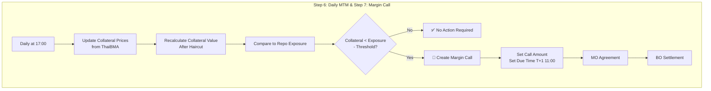

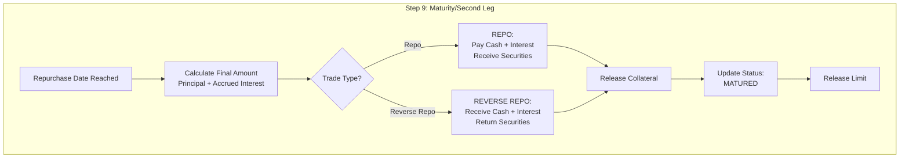

---

## 4. Client Onboarding Flow

### Overall Flow

```mermaid
flowchart TD
    Start([Start]) --> S1[Step 1: Entity Setup<br/>Back Office]
    S1 --> S2[Step 2: Counterparty Setup<br/>Back Office]
    S2 --> S3[Step 3: Credit Risk Assessment<br/>Credit Risk Team]
    S3 -->|Approved| S4[Step 4: Limit Configuration<br/>Middle Office]
    S3 -->|Rejected| Reject[Reject Onboarding]
    S4 --> S5[Step 5: Netting Agreement<br/>Back Office<br/>(if Repo trading)]
    S5 --> S6[Step 6: KYC Approval<br/>Compliance]
    S6 -->|Approved| End([✅ Ready to Trade])
    S6 -->|Rejected| Reject
    Reject --> End2([❌ Onboarding Failed])
```

### Timeline

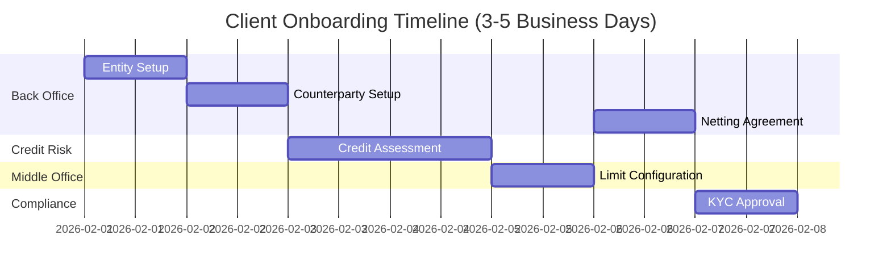

---

## 5. New Bond Setup Flow

### Overall Flow

```mermaid
flowchart TD
    Start([Start]) --> B1[Step 1: Security Master Setup<br/>Back Office]
    B1 --> B2[Step 2: Haircut Configuration<br/>Back Office<br/>(if Repo eligible)]
    B2 --> B3[Step 3: System Configuration<br/>IT Admin]
    B3 --> B4[Step 4: Initial Price Import<br/>Back Office]
    B4 --> End([✅ Ready for Trading])
```

### Timeline

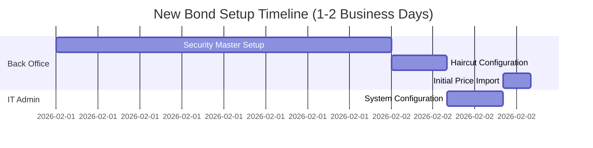

---

## 6. Daily Operations Flow

### End-to-End Daily Process

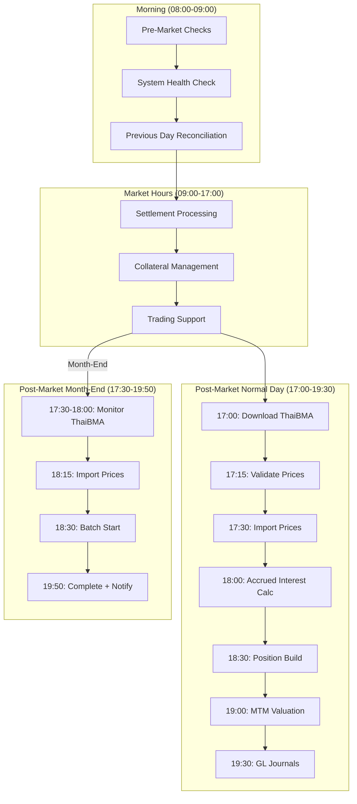

### ThaiBMA Import Detail

```mermaid
flowchart TD
    subgraph "Normal Day"
        N1[17:00: Login ThaiBMA Portal] --> N2[Download EOD File]
        N2 --> N3[17:15: Validate Prices]
        N3 --> N4{Price Movement?}
        N4 -->|±5-10%| N5[⚠️ Warning - Continue]
        N4 -->|±10-20%| N6[🚨 Alert - MO Approval]
        N4 -->|>±20%| N7[🛑 STOP - Risk Manager]
        N4 -->|OK| N8[17:30: Import to System]
    end
    
    subgraph "Month-End Day"
        M1[17:30: Start Monitoring] --> M2[Wait for Release]
        M2 --> M3[18:00: Download File]
        M3 --> M4[18:15: Validate & Import]
    end
```

---

## Status Icons Legend

| Icon | Meaning |
|------|---------|
| ✅ | Success / Complete |
| ❌ | Failure / Reject |
| ⚠️ | Warning |
| 🚨 | Alert |
| 🛑 | Hard Stop |
| ⏱️ | Time-sensitive |

---

## Team Abbreviations

| Abbreviation | Team |
|--------------|------|
| FO | Front Office (Trading) |
| MO | Middle Office (Risk) |
| BO | Back Office (Operations) |
| IT | IT Admin |

---

**Document End**

*For detailed process descriptions, see [Transaction Workflows](./TRANSACTION_WORKFLOWS.md)*  
*For field definitions, see [Field Reference](../01-DESIGN/FIELD_REFERENCE.md)*
