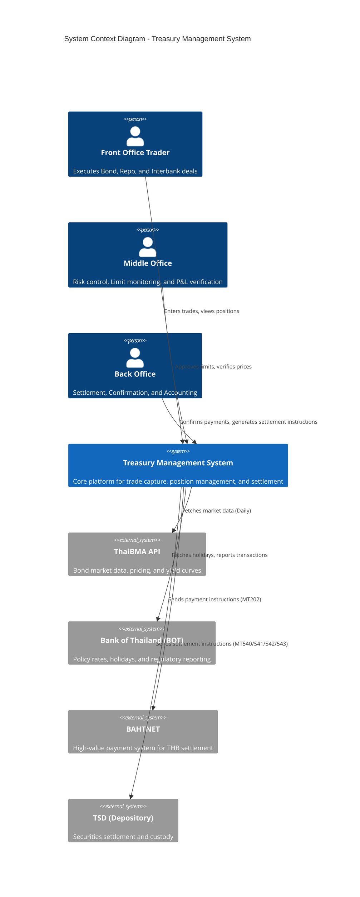
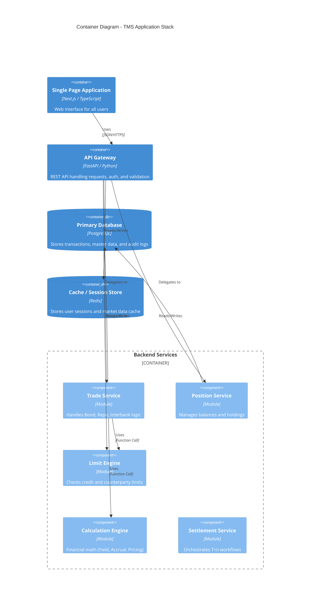
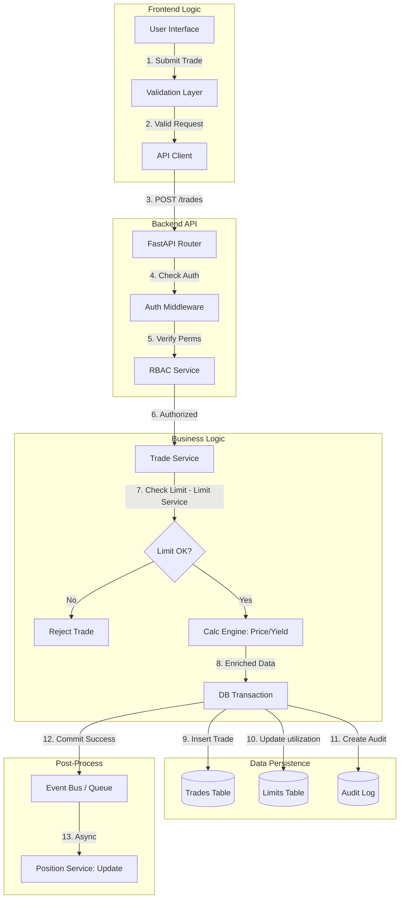
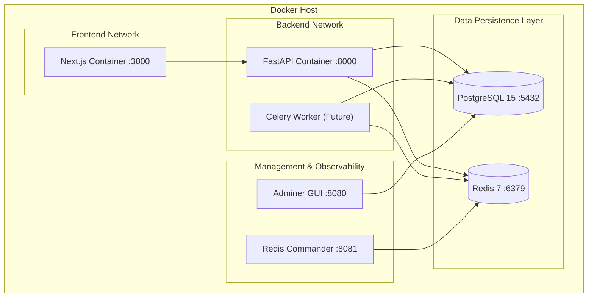

# System Landscape & Architecture Canvas

This document provides a high-level visual map of the entire Treasury Management System (TMS), connecting all modules into a single cohesive view.

## 1. C4 System Context Diagram
Shows how the TMS fits into the external banking ecosystem.

---

## 2. Container Diagram (High-Level Architecture)
Shows the internal software containers and their interactions.

---

## 3. Dynamic Data Flow (End-to-End)
Visualizes how data moves through the system during a typical trade lifecycle.

---

## 4. Infrastructure & Deployment Map
Shows how the system is deployed in a production-like environment (Docker).

