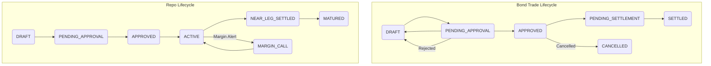
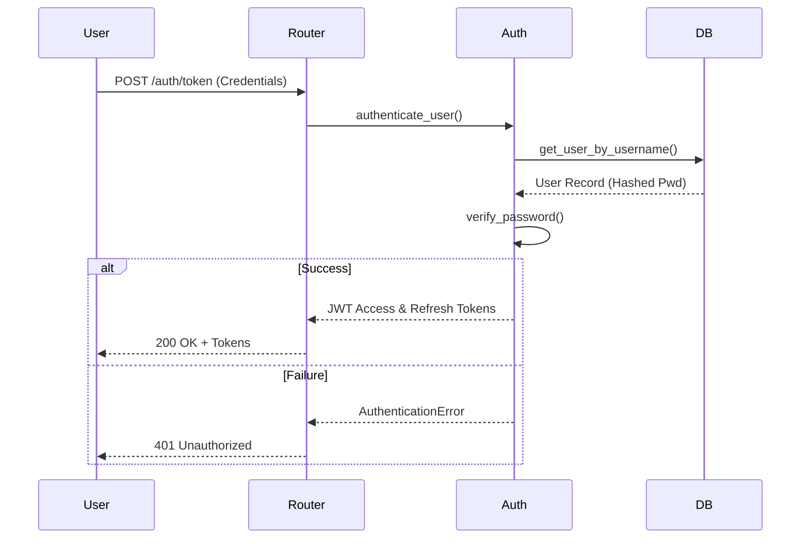
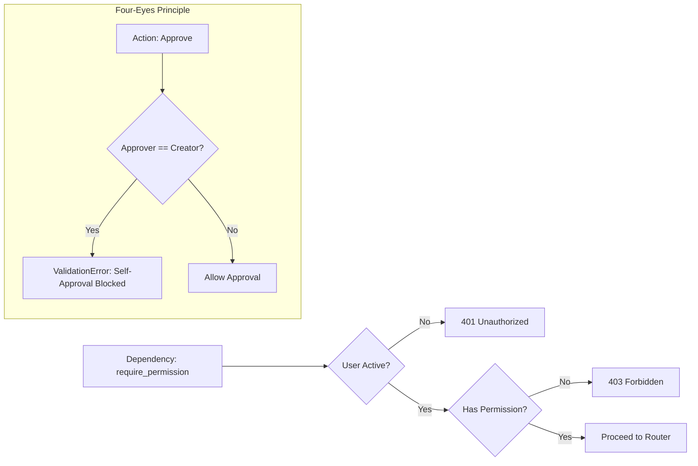

# Architecture & Flow: Core Module

This document details the core infrastructure of the Treasury Management System (TMS) backend.

## 1. Enums (`app/core/enums.py`)
**Purpose**: Centralized source of truth for all system constants, ensuring consistency across models, schemas, and services.

### Key Components:
- `TradeStatus`: Defines the lifecycle of all deals (DRAFT, PENDING_APPROVAL, etc.).
- `TradeSide`: BUY, SELL, LEND, BORROW.
- `Permission`: Granular action-based permissions.
- `AuditAction`: Types of actions captured in the audit trail.

---

## 2. State Machine (`app/core/state_machine.py`)
**Purpose**: Enforces valid state transitions for complex financial instruments.

### Transition Logic Flow:


---

## 3. Authentication & Security (`app/core/auth.py`, `app/core/security.py`)
**Purpose**: Handles JWT token generation, password hashing, and user identity verification.

### Authentication Flow:


---

## 4. Permissions & RBAC (`app/core/permissions.py`)
**Purpose**: Role-Based Access Control (RBAC) ensuring only authorized users can perform specific actions (e.g., Four-Eyes Principle).

### Permission Check Flow:


---

## 5. Global Exception Handling (`app/core/exceptions.py`)
**Purpose**: Unified error reporting across the API.

### Flow:
```mermaid
graph TD
    A[Service Error] --> B{Is TreasuryException?}
    B -- Yes --> C[Map to Custom HTTP Response]
    B -- No --> D[Internal Server Error 500]
    C --> E[JSON Response: {code, message, details}]
```
