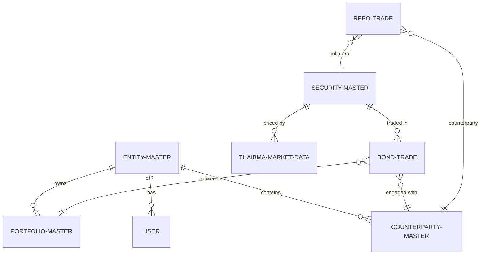
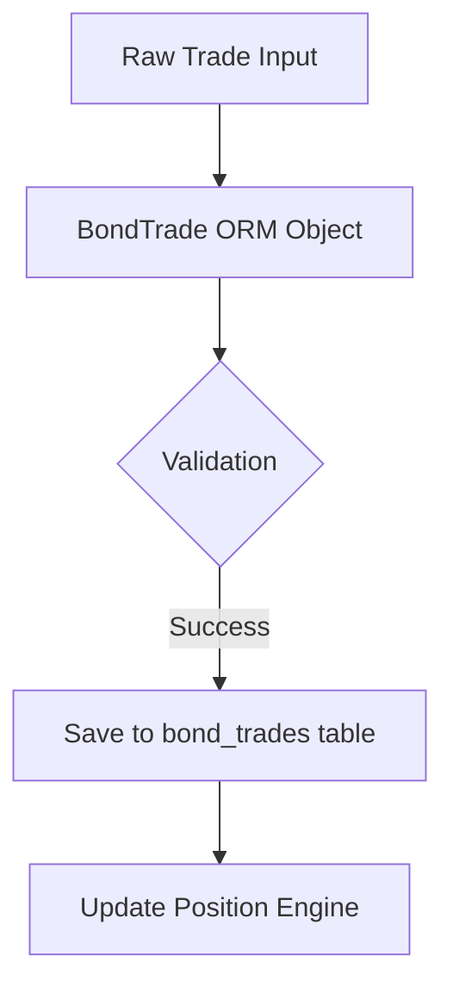
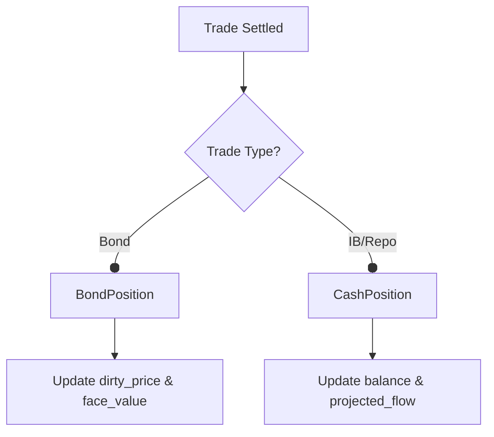
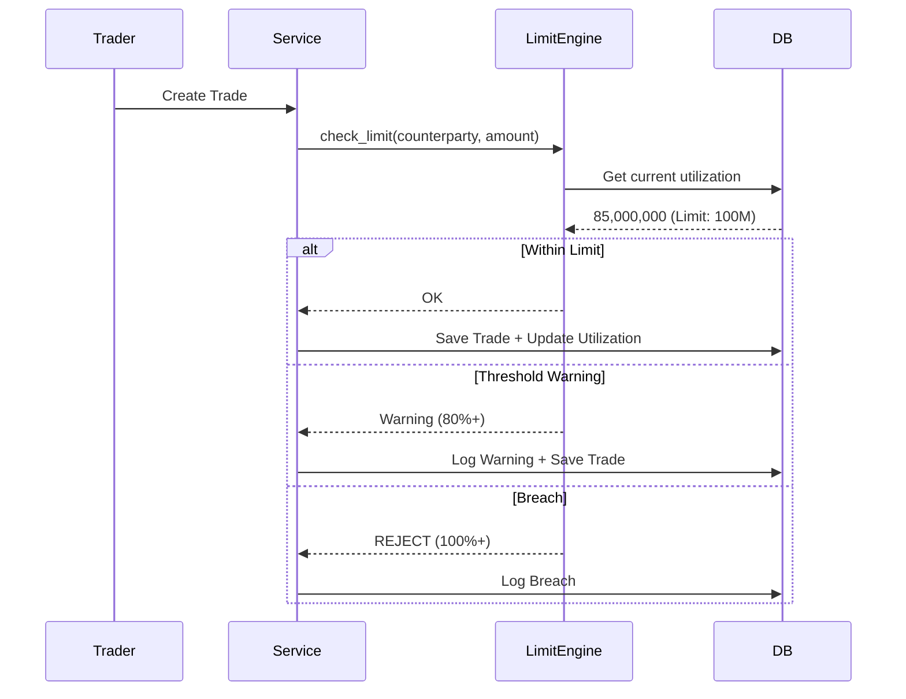

# Architecture & Data Schema: Models Module

This document outlines the data architecture and Entity-Relationship logic of the TMS.

## 1. Core Data Hierarchy
The system uses a hierarchical master data structure to support multi-entity bank operations.

### Entity Relationship Diagram (Conceptual):

---

## 2. Transaction Models (`app/models/transactions.py`)
**Purpose**: Persistent storage for all trade types.

### Bond Trade Flow to DB:

### Repo Trade Complexity:
- `RepoTrade` tracks both legs: Near Leg (Cash Out/In) and Far Leg (Maturity).
- Linkage to `CollateralPosition` ensures collateral is blocked.

---

## 3. Position Tracking (`app/models/positions.py`)
**Purpose**: Real-time balance and holding tracking.

### Balance Update Flow:

---

## 4. Audit Trail (`app/models/audit.py`, `app/models/users.py`)
**Purpose**: Regulatory compliance (SEC/BOT) for all financial actions.

### Audit Logging Logic:
- **Immutable**: Records are append-only.
- **Detailed**: Stores `old_values` and `new_values` as JSON to track specific field changes.
- **Traceable**: Includes `correlation_id` to link multiple actions in one workflow.

---

## 5. Risk & Limits (`app/models/limits.py`)
**Purpose**: Pre-trade and post-trade risk control.

### Limit Check Sequence:

