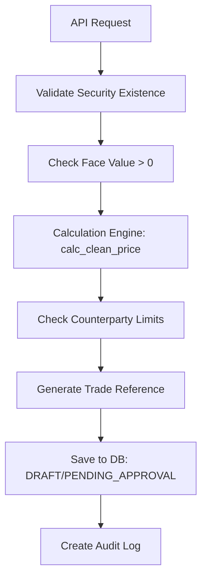
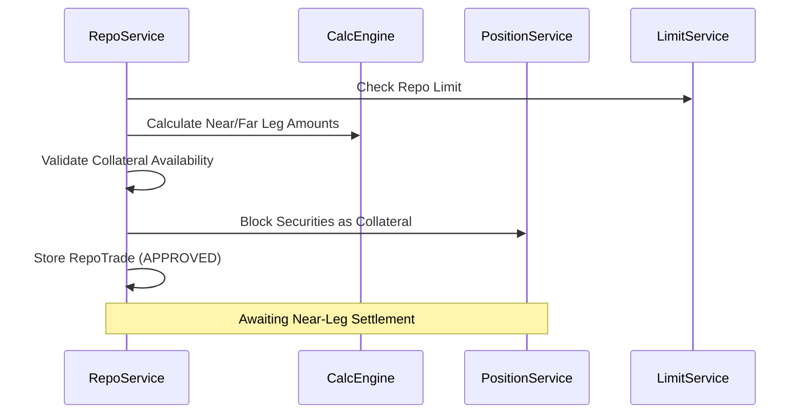

# Architecture & Logic Flow: Services Module

The Services Module contains the business logic that transforms raw API inputs into financial transactions and position updates.

## 1. Bond Trade Service (`app/services/bond_trade_service.py`)
**Purpose**: Handles the lifecycle of bond purchases and sales.

### Trade Creation Workflow:


---

## 2. Repo Service (`app/services/repo_service.py`)
**Purpose**: Manages complex Repo/Reverse Repo trades with collateral management.

### Repo Lifecycle Logic:


---

## 3. Calculation Engine (`app/services/calculation_engine.py`)
**Purpose**: Financial math for pricing, yields, and interest.

### Engine Architecture:
- Stateless functions for pure calculations.
- Supports ThaiBMA standard (ACT/365, ACT/360).
- **Functions**: `calculate_accrued_interest`, `clean_to_dirty_price`, `repo_interest`.

---

## 4. Settlement Service (`app/services/settlement_service.py`)
**Purpose**: Orchestrates the movement of cash and securities on settlement date (T+2).

### Settlement Flow:
```mermaid
graph TD
    A[Daily Batch / Manual Trigger] --> B{Trade Status == APPROVED?}
    B -- Yes --> C{Settlement Date == Today?}
    C -- Yes --> D[Initiate BAHTNET/TSD Flow]
    D --> E[Update BondPosition (Security balance)]
    D --> F[Update CashPosition (Cash balance)]
    F --> G[Mark Trade as SETTLED]
    G --> H[Generate Settlement Confirmation]
```

---

## 5. ThaiBMA Service (`app/services/thaibma_service.py`)
**Purpose**: Integration with Thai Bond Market Association for market data and trade reporting.

### Data Ingestion Flow:


---

## 6. Calendar Service (`app/services/calendar_service.py`)
**Purpose**: Determines business days based on Bank of Thailand (BOT) holidays.

### Logic:
- `is_business_day(date)`: Checks against holiday database.
- `add_business_days(date, n)`: Calculates T+n dates accurately.
