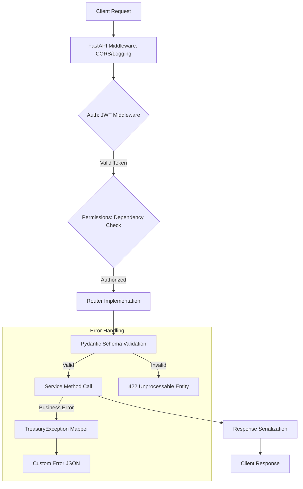
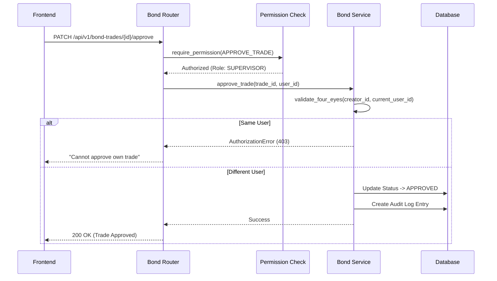

# Architecture & Request Flow: API Routers

The Routers module serves as the entry point (FastAPI controllers), handling HTTP requests, validation through Pydantic schemas, and delegation to backend services.

## 1. Request Lifecycle Overview
Every request to the TMS API follows this standard path:

---

## 2. Key Routers and Their Roles

| Router | Purpose | Key Endpoints | Dependencies |
| :--- | :--- | :--- | :--- |
| `auth_router` | Identity Management | `/login`, `/refresh`, `/me` | User Service, Auth Utility |
| `bond_trades_router` | Trade Capture | `POST /` (Capture), `PATCH /{id}/approve` | Bond Service, Four-Eyes Check |
| `repo_router` | Collateralized Trading | `POST /create`, `GET /active` | Repo Service, Position Service |
| `settlement_router` | Ops Management | `GET /pending`, `POST /execute` | Settlement Service |
| `market_data_router` | Pricing Feeds | `POST /upload`, `GET /price/{symbol}` | ThaiBMA Service |

---

## 3. Data Flow Example: Trade Approval
This flow ensures the "Four-Eyes Principle" where the person who entered the trade cannot be the one who approves it.

---

## 4. Middleware and Security Headers
- **CORS**: Restricted to allowed origins specified in `.env`.
- **Logging**: Captures request metadata (method, path, user_id) for every transaction.
- **Exception Handlers**: Located in `app.core.exceptions`, they catch business-specific errors and return standardized JSON status codes.
