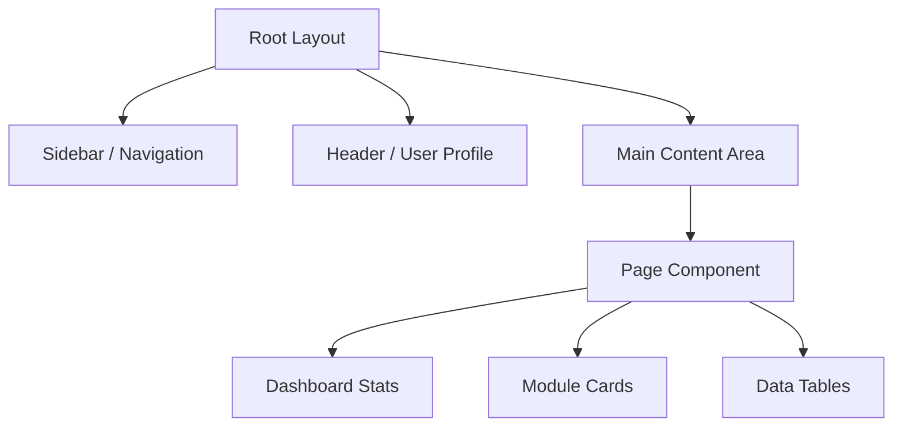
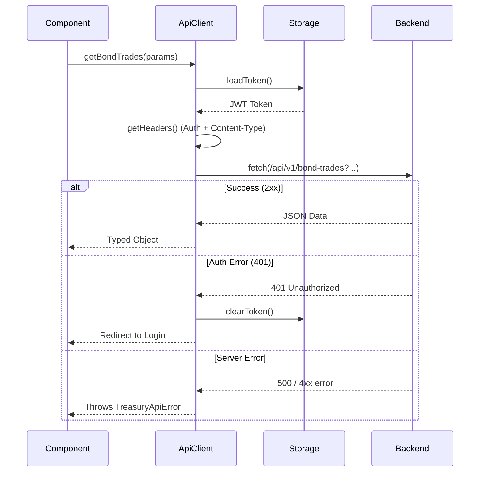
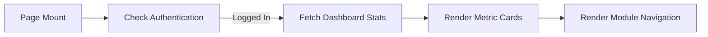

# Architecture & Flow: Frontend Module

The Treasury Management System (TMS) frontend is a modern, responsive web application built with Next.js, providing a professional interface for treasury operations.

## 1. Tech Stack & Core Technologies
- **Framework**: [Next.js](https://nextjs.org/) (App Router)
- **Language**: TypeScript
- **Styling**: Tailwind CSS
- **Icons**: Lucide React
- **API Client**: Fetch API with custom wrapper

---

## 2. Directory Structure
```text
src/
├── app/            # Next.js App Router pages and layouts
├── components/     # Reusable UI and Layout components
│   ├── layout/     # Shell, Sidebar, Navigation
│   └── ui/         # Buttons, Cards, Inputs, Tables
├── lib/            # Shared utilities and API client
└── types/          # TypeScript interfaces (mirroring backend)
```

---

## 3. Component Architecture

### Layout Hierarchy:


---

## 4. API Communication Flow (`src/lib/api.ts`)
The `ApiClient` acts as a centralized gatekeeper for all backend communication.

### Request Flow:


---

## 5. Main Dashboard Architecture (`src/app/page.tsx`)
The home page serves as the mission control for the treasury department.

### Features:
1.  **Metric Ribbons**: Real-time snapshot of Total Volume, Active Deals, and Pending Settlements.
2.  **Product Gateways**: Quick access to Bond Trading, Interbank, and Repo modules.
3.  **Operation Modules**: Links to Settlement, Positions, and Limits monitoring.
4.  **Responsive Design**: Optimized for desktop treasury desks while remaining accessible on tablets.

### Data Rendering Logic:


---

## 6. Type Safety (`src/types/index.ts`)
The frontend uses strict TypeScript interfaces that exactly match the backend's Pydantic schemas, ensuring full-stack type safety for:
-   **Trade Objects**: `BondTrade`, `RepoTrade`, `InterbankDeal`.
-   **Master Data**: `Security`, `Counterparty`, `Portfolio`.
-   **Positions**: `BondPosition`, `CashPosition`.
