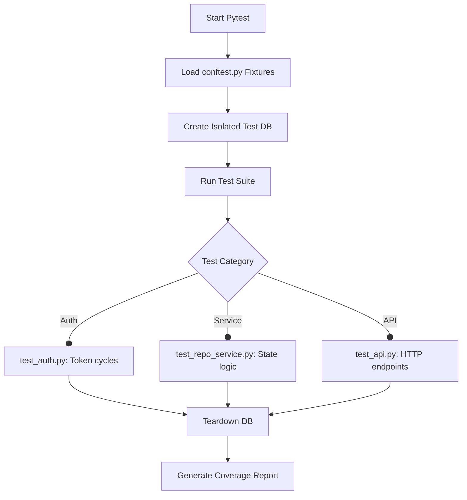
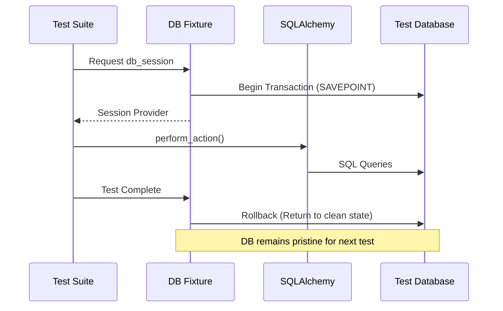
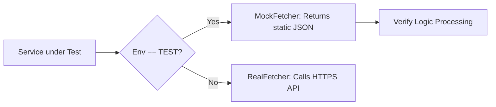

# Architecture & Flow: Testing Framework

The TMS employs a multi-layered testing strategy to ensure reliability, financial accuracy, and security.

## 1. Testing Layers
The system is divided into three primary testing domains:

- **Unit Tests**: testing individual functions (e.g., `calculation_engine.py`) with zero dependencies.
- **Service Tests**: testing complex business logic in `app.services`, often using a test database.
- **API Tests**: testing full HTTP request/response cycles, including authentication and CORS.

---

## 2. Test Execution Flow
Tests are orchestrated via `pytest`, with localized `conftest.py` files managing shared fixtures.

---

## 3. Database Isolation Strategy
To ensure tests are idempotent and fast, the framework uses an isolated database instance.

### Logical Interaction:

---

## 4. External Service Mocking
External integrations (like ThaiBMA or Bank of Thailand APIs) are mocked during testing to avoid network latency and dependency on external uptime.

### Mocking Flow:

---

## 5. Security Testing
- **Role-Based Access**: Specialized tests verify that a `TRADER` cannot access `admin` endpoints.
- **Four-Eyes Verification**: Explicitly testing that self-approval attempts return `AuthorizationError (403)`.
- **JWT Integrity**: Verifying that expired or malformed tokens are rejected with `401 Unauthorized`.
