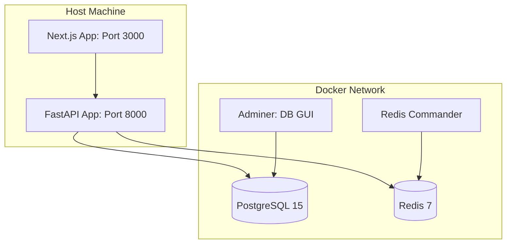
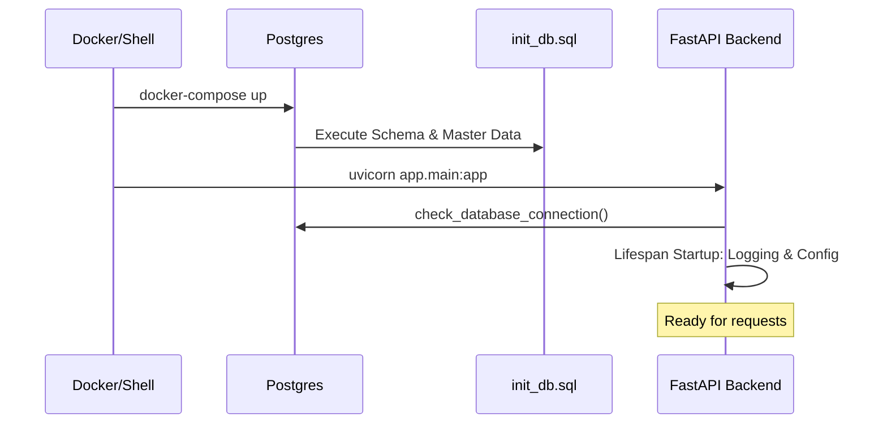
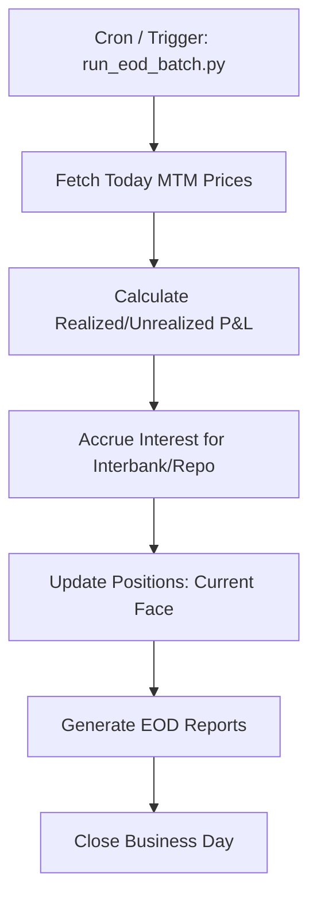

# Architecture & Operations: DevOps & Deployment

This document details the operational architecture, local development environment, and production lifecycle of the TMS.

## 1. Local Development Stack (Docker)
The system uses `docker-compose.local.yml` to orchestrate essential back-end infrastructure.

### Container Architecture:

---

## 2. Startup & Initialization Flow
When the system starts, it undergoes a multi-stage initialization to ensure data integrity.

---

## 3. Persistent Storage Strategy
- **Volumes**: Databases use Docker Volumes (`tms_postgres_data`) for persistence across container restarts.
- **Backups**: The `scripts/init_db.sql` provides a baseline state for the Money Market, Bond, and Repo environments.

---

## 4. Operational Workflows (Batch Jobs)
Treasury systems rely on End-of-Day (EOD) processing for valuation and interest accrual.

### EOD Batch Process Flow:

---

## 5. Environment Configuration
The system uses Pydantic Settings to load variables from `.env`.

- **Security**: `SECRET_KEY` and `JWT_ALGORITHM` are non-negotiable for production.
- **Integrations**: `THAIBMA_API_URL` and `BOT_API_KEY` control external data flows.
- **Modes**: `TSD_MODE` and `BAHTNET_MODE` allow switching between `manual` (CSV-based) and `api` workflows.
